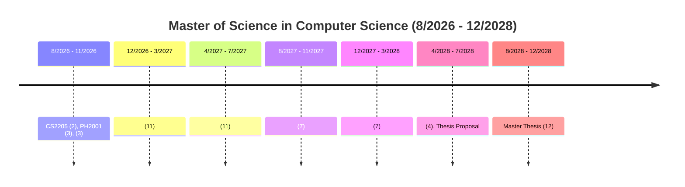

# MSCS [2026-2029]

| CourseID | CourseTitle | Credit |
| :--- | :--- | :--- |
| CS2205 | Scientific Research methodology | 2 |
| PH2001 | Philosophy | 3 |
| CS2208 | Decision Support Systems | 3 |
| CE2207 | Application of Artificial Generative Intelligence | 4 |
| CS2225 | Visual Recognition and Applications | 3 |
| CS2203 | Image Processing and Computer Vision | 4 |
| CS2230 | Deep Learning Models and Applications | 3 |
| NT2102 | Information System Safety and Security | 4 |
| CS2207 | Data Mining & Applications | 4 |
| CS2229 | Machine learning algorithms and theory | 4 |
| CE2002 | Management and Leadership Skills for Computer Engineering | 3 |
| IT2011 | Advanced Database Systems | 4 |
| IT2030 | Advanced geographic information system | 3 |
| CE2208 | Parallel System Programming with GPU | 4 |
| CS2501 | Thesis | 12 |
